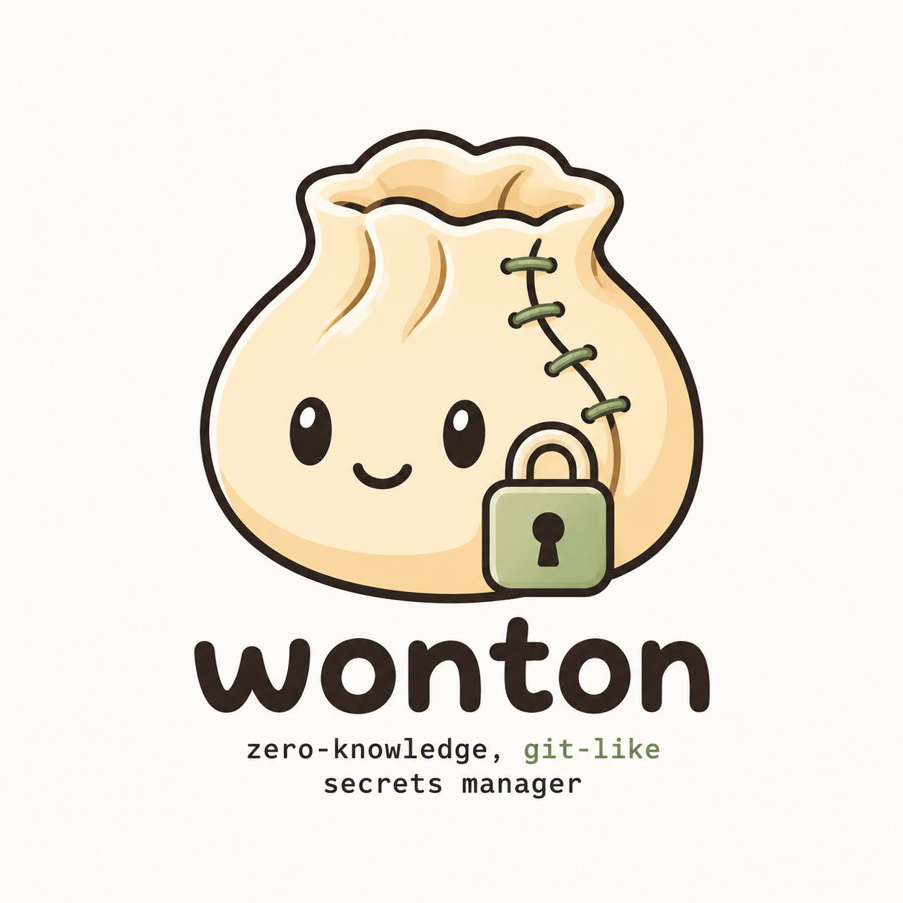

<div align="center">
  

  <h1>Wonton</h1>

  <p><strong>A zero-knowledge, GitHub-shaped secrets manager built for agentic development.</strong></p>

  <p>
    Org → repo → branch, exactly like GitHub — except every branch is its own encryption
    boundary (its own key, its own access list, its own history), and the server that stores and
    syncs it never holds a key that can read a single value. Grant an AI agent exactly the branch
    it needs, hand it secrets without ever putting them in a prompt or a `.env` file, and revoke
    it the instant the job is done.
  </p>

  <p>
    <a href="#license"></a>
    <a href="https://www.rust-lang.org"></a>
    <a href="#how-it-works"></a>
  </p>
</div>

---

```console
$ wonton login alice --server https://wonton.example.com
$ wonton init                      # fully local — zero network calls
$ wonton set DATABASE_URL=postgres://prod-db/acme API_KEY=sk-live-...
$ wonton commit -m "seed prod secrets"
$ wonton push                      # first push provisions org/store/branch on the server
$ wonton grant bob --role reader
$ wonton run -- ./start-server
```

## Table of contents

- [Why](#why)
- [Features](#features)
- [How it works](#how-it-works)
- [Installation](#installation)
- [Quickstart](#quickstart)
- [Command reference](#command-reference)
- [Dashboard](#dashboard)
- [Project layout](#project-layout)
- [Security model](#security-model)
- [Status](#status)
- [Testing](#testing)
- [Branding](#branding)
- [License](#license)

## Why

Most teams either paste secrets into a chat, hand-roll a shared `.env` file, or trust a vault
service to hold plaintext on their behalf. Wonton is built around a simpler premise: **the party
storing and relaying your secrets' history should be incapable of reading them, even if fully
compromised.** The server sees ciphertext, content hashes, and metadata (who pushed what, when)
— never a decrypted value, a data-encryption key, or a private key.

This matters more, not less, once AI coding agents are doing the work. A `.env` file handed to
an agent sits in its subprocess environment, shell history, and every tool call it makes — with
no scoping (it's all-or-nothing) and no revocation short of rotating the secret itself
everywhere it's used. Wonton gives an agent exactly the branch it needs and nothing else
(`wonton grant coding-agent --role reader --branch ci`), injects secrets straight into its
subprocess environment and nowhere else (`wonton run -- <agent's command>` — never a prompt,
never a file on disk), and cuts it off instantly when the task is done (`wonton revoke
coding-agent`) by rotating the branch's key, not the secret values. Like any authorized reader,
an agent that has decrypted a value could still misuse it — that's a property of secrets access
generally, not something any secrets manager can prevent (see [Security model](#security-model))
— but scoping *what* it can reach and revoking *when* it's done are exactly the two levers this
model is built around.

## Features

- **Zero-knowledge by construction** — the server never depends on the crypto crate at all
  (enforced by Cargo *and* a compile-time test); there is no code path that could receive a key
  even by accident.
- **Org → repo → branch, GitHub-shaped** — every user belongs to an org; a store (repo) lives in
  an org; a branch is the actual encryption/access boundary. Sharing a branch with someone who
  isn't yet in the org adds them to it, scoped by the grant they were actually given.
- **Local-first, like git** — `wonton init` and `wonton branch -b <name>` are 100% local (zero
  network calls); server contact happens exactly once, at the first `wonton push` on a branch,
  which provisions it and self-grants its key.
- **A branch is a real key boundary, not just a pointer** — `wonton branch -b dev --from
  staging` mints a brand-new key for `dev`, seeded from `staging`'s current values. Having
  access to `staging` does **not** imply access to `dev` — each is shared separately.
- **O(1) sharing** — granting access wraps a copy of the branch's key for the new member; it
  never re-encrypts existing history.
- **Real revocation** — revoking a member rotates the key and re-encrypts history so their
  cached copy provably can't decrypt anything committed afterward.
- **Three-way merge across two different keys** — merging one branch into another reconciles
  content encrypted under two independent DEKs, with an interactive resolver for conflicting
  keys.
- **A key agent, not a passphrase prompt every time** — unlock once per session; an ssh-agent-
  style daemon holds keys in memory behind a local, permission-locked Unix socket.
- **Only two ways to touch plaintext** — `wonton run` (injects into a subprocess's environment,
  never disk) and `wonton export` (an explicit, warned opt-in). Nothing else ever writes a
  decrypted value to disk.

## How it works

Each **branch** (e.g. `acme/backend`'s `prod` branch) has its own random 256-bit **data
encryption key (DEK)** — it's the crypto/ACL unit, not just a pointer into shared history.
Every secret value is encrypted under that DEK with a fresh nonce (XChaCha20-Poly1305). The DEK
itself is wrapped separately for every authorized user with their X25519 public key
(`crypto_box` sealed box):

```
passphrase --Argon2id--> unlock key --decrypts--> your private key (Ed25519 + X25519)
                                                          |
                                         unwraps (X25519 sealed box)
                                                          v
                                        branch's Data Encryption Key (DEK)
                                                          |
                                         encrypts (XChaCha20-Poly1305)
                                                          v
                                              individual secret values
```

History is a content-addressed Merkle DAG of blob/tree/commit objects (BLAKE2b-256), with every
commit Ed25519-signed by its author. `push`/`pull` move encrypted objects and compare-and-swap
a branch's ref; every object is content-hash-verified and every commit's signature is verified
on the client before it's trusted — the server is never in the trust path.

A project directory is bound to a store — and a branch within it — by a single `wonton.toml`
(`server` + `store = "org/store"` + `branch`), read fresh on every command. It's meant to be
committed, so switching branches (`wonton branch <name>`) is a change collaborators pick up once
you push it, not a per-clone-only pointer. `wonton.toml`'s `server` field is authoritative for
identity selection too: if you have several
identities logged in on one machine (different servers), a directory-bound command narrows to
the one matching this project's server automatically — `--identity` is only needed to
disambiguate two identities on the *same* server. The underlying key agent only ever holds one
identity's key material unlocked at a time (like `ssh-agent` with a single loaded key) — each
`login` becomes the new *current* identity, which is what commands fall back to instead of
demanding `--identity` just because more than one is cached. `wonton logout [<name>]` forgets a
cached identity entirely (and locks the agent if it was the resident one).

## Installation

Requires a stable Rust toolchain (2021 edition).

```console
git clone https://github.com/wonton/wonton
cd wonton
cargo build --release --workspace
./target/release/wonton --help
```

## Quickstart

Originating a new project — nothing needs to exist on the server beforehand:

```console
# Unlock your identity into the local key agent (registers on first use).
$ wonton login alice --server https://wonton.example.com

# Bootstrap a project in the current directory. Prompts for the org if you don't pass one
# (defaults to your username — just hit enter); store defaults to the directory name, branch
# to "main". Zero network calls; writes wonton.toml.
$ wonton init

# Stage and commit secrets — fully local, no DEK has ever left your machine.
$ wonton set DATABASE_URL=postgres://prod-db/acme API_KEY=sk-live-...
$ wonton commit -m "seed prod secrets"

# First push provisions org/store/branch on the server and self-grants the DEK.
$ wonton push
$ git add wonton.toml && git commit -m "wonton init" && git push   # commit it — it's the whole marker now

# Look at what's on the branch right now (nothing touches disk).
$ wonton view

# Inject the decrypted values into a subprocess — never written to disk.
$ wonton run -- ./start-server

# Load secrets into the CURRENT shell (a subprocess like `run` can never do this for its parent).
$ eval "$(wonton expose)"

# Or materialize them explicitly to a file (prints a plaintext warning first; defaults to .env).
$ wonton export

# Grant access (also adds bob to the org, scoped to this branch — bob must have logged in once).
$ wonton grant bob --role reader

# Branch off with its own key, seeded from the current branch's values, and merge back.
$ wonton branch -b feature --from main
$ wonton set FEATURE_FLAG=on
$ wonton commit -m "enable feature flag"
$ wonton push
$ wonton branch main
$ wonton merge feature

# Revoke access (rotates the DEK; a revoked user's cached key stops working).
$ wonton revoke bob
```

Joining an existing project (a normal `git clone` carries `wonton.toml` along for free — no
extra command needed once you've logged in):

```console
$ git clone <repo> && cd <repo>
$ wonton login bob --server https://wonton.example.com
$ wonton set FOO=bar     # notices no local history yet, auto-pulls, then just works
```

For a directory that isn't a git checkout, `wonton clone <org> <store> [branch]` writes the
marker directly.

## Command reference

| Command | Description |
|---|---|
| `login <user>` | Unlock an identity into the agent, registering it on first use |
| `logout [<name>]` | Forget a cached identity locally (defaults to the sole/current one); locks the agent if it was the resident identity |
| `whoami` | Show cached identities, marking which one is current |
| `config set-server <url>` | Set a default server for `login` to fall back on when `--server` is omitted |
| `config show` | Show the currently configured default server, if any |
| `init [org] [store] [branch]` | Bootstrap a project in the current directory — fully local |
| `clone <org> <store> [branch]` | Bind the current directory to an existing org/store/branch |
| `branch` | List branches (syncs with the server's accessible list, like `git branch -a`), marking the current one |
| `branch <name>` | Switch branches (unwraps/auto-pulls its DEK if needed) |
| `branch -b <name> [--from <src>]` | Create a branch with its own DEK, optionally seeded from `<src>` |
| `store create <org> <name>` | Advanced/manual: provision a store directly (`init`/`branch -b` defer this to `push`) |
| `status` | Show the current workspace, branch, DEK-cache status, ahead/behind vs. the remote, and staged changes |
| `set KEY=VALUE ...` | Stage one or more secrets on the current branch |
| `unset KEY ...` | Stage deletion of one or more keys |
| `commit -m "..."` | Commit the staged changes |
| `log` | Show the verified commit history of the current branch |
| `diff [a] [b]` | Diff two commits (or the last commit's change if no args are given) |
| `pull` | Fetch and fast-forward the current branch from the server |
| `push` | Upload local commits and move the branch ref; first push on a branch provisions it |
| `merge <branch>` / `merge --continue` | Three-way merge another branch (own DEK) in, or resume one paused on conflicts |
| `run -- <cmd>` | Run a command with secrets injected as env vars — never written to disk |
| `view [--keys-only]` | Print the current branch's decrypted secrets to stdout — nothing touches disk |
| `export --format dotenv <path>` | Export secrets to a file (plaintext — prints a warning) |
| `expose` | Print `export KEY='VALUE'` statements for `eval "$(wonton expose)"` — loads secrets into the CURRENT shell |
| `grant <user> [--branch <name>]` | Grant a user access to a branch (wraps the DEK; O(1)); auto-joins them to the org |
| `revoke <user> [--branch <name>]` | Revoke a user's access (removes them and rotates the DEK) |
| `key rotate [--branch <name>]` | Rotate a branch's DEK, re-encrypting history and re-wrapping it |

Run `wonton --help` or `wonton <command> --help` for full details.

## Dashboard

A read-only web viewer lives in [`dashboard/`](dashboard/): browse orgs/stores/branches you have
access to, see verified commit history, and view decrypted current values, all in the browser.
No `set`/`commit`/`push`/`grant` from there yet (v1 is deliberately view-only).

Two things that differ from the CLI, both by design:
- **OAuth (Google, currently) gates *registration*, not login.** It proves you control a real
  email before the server lets you claim a username — it does not replace the passphrase-derived
  key. Login (existing identity) is the exact same challenge-response the CLI uses, passphrase
  only. Set `WONTON_GOOGLE_CLIENT_ID` / `WONTON_GOOGLE_CLIENT_SECRET` / `WONTON_GOOGLE_REDIRECT_URI`
  on `wonton-server` to enable it; unset (the default) leaves registration open/unverified,
  exactly as before.
- **Browser key custody is honestly weaker than the CLI's.** The CLI's agent is a native process
  behind a `0600` Unix socket; a browser tab has no equivalent isolation from other JS on the
  same origin. The dashboard never persists an unlocked identity or DEK to
  `localStorage`/IndexedDB — everything lives in WASM memory for the current tab's session only,
  gone on reload. Re-entering your passphrase each session is the accepted cost of that model,
  not an oversight.

The actual crypto is `crates/wasm` (`wonton-wasm`) — `wasm-bindgen` bindings over the same,
already-tested `wonton-crypto`/`wonton-objects`, not a reimplementation. See
[`dashboard/README.md`](dashboard/README.md) for setup (`wasm-pack` + Node) and
[`crates/wasm/src/lib.rs`](crates/wasm/src/lib.rs)'s module docs for why the history-walking
orchestration lives in the dashboard's TypeScript rather than reusing `wonton-vcs::log` directly.

`wonton-server` can optionally serve the dashboard's static build itself — set
`WONTON_DASHBOARD_DIST` to `dashboard/dist` (after `npm run build` there) for a single-binary
self-hosted deploy; leave it unset to host the dashboard separately (API-only server, needs
nothing beyond CORS on your end).

## Project layout

| Crate | Role |
|---|---|
| `wonton-crypto` | Primitives: Argon2id, XChaCha20-Poly1305, X25519 sealed box, Ed25519 |
| `wonton-objects` | Content-addressed blob/tree/commit objects, BLAKE2b hashing |
| `wonton-vcs` | Local commit/log/diff/merge — the client-side history engine |
| `wonton-sync` | Push/pull client: CAS refs, integrity verification (never touches crypto) |
| `wonton-server` | The blind blob+ref store: auth, RBAC, wrapped-DEK maps, OAuth registration gate (never touches crypto) |
| `wonton-shared` | Wire types shared between client and server (ciphertext only) |
| `wonton` (cli) | The `wonton` binary: CLI porcelain, the key agent, the crypto engine |
| `wonton-wasm` | Browser bindings over `wonton-crypto`/`wonton-objects` for the dashboard |
| `dashboard/` | The read-only web viewer (TypeScript/Vite, not a Cargo crate) |

Dependency direction is enforced by Cargo *and* a compile-time test: `wonton-server` and
`wonton-sync` can never depend on `wonton-crypto` — the server is structurally incapable of
decryption, not just policy-incapable.

## Security model

**In scope (defended against):** a fully compromised server or stolen database yields no
plaintext; an honest-but-curious operator can't read values; a network attacker (even a
malicious server) can't tamper with history undetected, thanks to the hash-chained Merkle DAG
and per-commit signatures.

**Accepted metadata leakage:** the server does see the number of orgs/stores/branches and how
many secrets each holds, key *names* (plaintext by design), timing/frequency
of pushes and who made them, and org/store/branch names and topology. It never sees a value.

**Out of scope (v1):** traffic-analysis resistance, a compromised client that already holds an
unlocked key, or a legitimately authorized user exfiltrating values they can already read.

## Status

Core functionality is complete and tested: crypto primitives, local commit/log/diff, the
org/store/branch server + sync layer, the full CLI command surface (`init`/`clone`/`branch`
included), granting/revocation/key rotation (with automatic org membership on grant), three-way
client-side merge across two independently-keyed branches with conflict resolution, an OAuth
registration gate, and a read-only web dashboard. Recovery (a lost-passphrase story), deeper
machine-identity hardening, and a writable dashboard (`set`/`commit`/`push`/`grant` from the
browser) remain intentionally deferred.

## Testing

```console
cargo test --workspace          # or: cargo nextest run --workspace
cargo clippy --workspace --all-targets
cargo audit

# crates/wasm: native #[test]s cover the crypto logic directly (see its module docs for why
# wasm-bindgen's own types can't run natively for every path); wasm-pack exercises the real
# wasm-bindgen boundary in an actual browser engine.
cargo test -p wonton-wasm
wasm-pack test --headless --chrome crates/wasm   # or --firefox; needs a browser installed

cd dashboard && npm install && npm run build      # type-checks + builds the frontend
```

## Branding

Logo assets live in [`assets/`](assets/): `wonton-solo.png` is the icon alone on a transparent
background (what's used above, and the one to reach for on a dark or colored surface);
`wonton.png` is the full lockup with the wordmark and tagline baked in, which reads better as a
flat social-preview card (GitHub → Settings → Social preview) than embedded inline.

## License

Licensed under either of [MIT](https://opensource.org/licenses/MIT) or
[Apache License, Version 2.0](https://www.apache.org/licenses/LICENSE-2.0), at your option.
