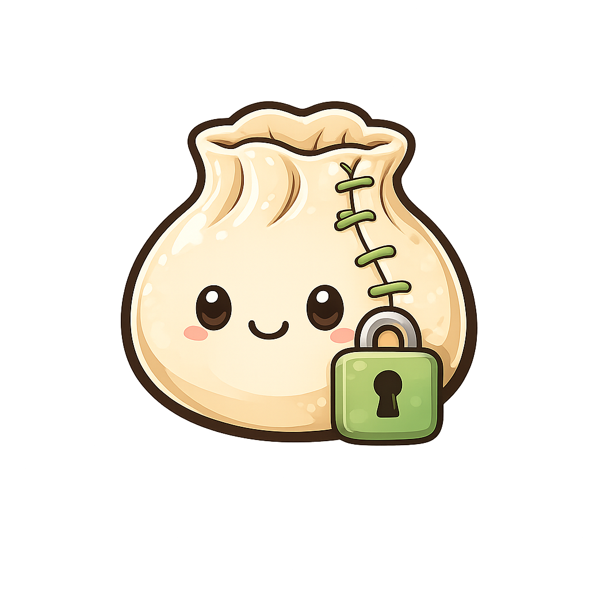

<div align="center">
  

  <h1>Wonton</h1>

  <p><strong>A zero-knowledge, git-like secrets manager.</strong></p>

  <p>
    Version, diff, branch, and merge your environment variables the way you do source code —
    except every value is end-to-end encrypted, and the server that stores and syncs your
    history never holds a key that can read it.
  </p>

  <p>
    <a href="#license"></a>
    <a href="https://www.rust-lang.org"></a>
    <a href="#how-it-works"></a>
  </p>
</div>

---

```console
$ wonton set DATABASE_URL=postgres://prod-db/acme API_KEY=sk-live-...
$ wonton commit -m "seed prod secrets"
$ wonton push
$ wonton share bob --env acme-dev --role reader
$ wonton run -- ./start-server
```

## Table of contents

- [Why](#why)
- [Features](#features)
- [How it works](#how-it-works)
- [Installation](#installation)
- [Quickstart](#quickstart)
- [Command reference](#command-reference)
- [Project layout](#project-layout)
- [Security model](#security-model)
- [Status](#status)
- [Testing](#testing)
- [Branding](#branding)
- [License](#license)

## Why

Most teams either paste secrets into a chat, hand-roll a shared `.env` file, or trust a vault
service to hold plaintext on their behalf. Wonton is built around a simpler premise: **the party
storing and relaying your secrets' history should be incapable of reading them, even if fully
compromised.** The server sees ciphertext, content hashes, and metadata (who pushed what, when)
— never a decrypted value, a data-encryption key, or a private key.

## Features

- **Zero-knowledge by construction** — the server never depends on the crypto crate at all
  (enforced by Cargo *and* a compile-time test); there is no code path that could receive a key
  even by accident.
- **Git-like workflow** — `set` / `commit` / `log` / `diff` / `branch` / `merge`, with a signed,
  content-addressed Merkle DAG of history underneath.
- **O(1) sharing** — granting access wraps a copy of the environment's key for the new member;
  it never re-encrypts existing history.
- **Real revocation** — revoking a member rotates the key and re-encrypts history so their
  cached copy provably can't decrypt anything committed afterward.
- **Three-way merge** — genuine conflict detection and resolution across divergent branches,
  including an interactive resolver for conflicting keys.
- **A key agent, not a passphrase prompt every time** — unlock once per session; an ssh-agent-
  style daemon holds keys in memory behind a local, permission-locked Unix socket.
- **Only two ways to touch plaintext** — `wonton run` (injects into a subprocess's environment,
  never disk) and `wonton export` (an explicit, warned opt-in). Nothing else ever writes a
  decrypted value to disk.

## How it works

Each **environment** (e.g. `acme/backend@prod`) has its own random 256-bit **data encryption
key (DEK)**. Every secret value is encrypted under that DEK with a fresh nonce
(XChaCha20-Poly1305). The DEK itself is wrapped separately for every authorized user with their
X25519 public key (`crypto_box` sealed box):

```
passphrase --Argon2id--> unlock key --decrypts--> your private key (Ed25519 + X25519)
                                                          |
                                         unwraps (X25519 sealed box)
                                                          v
                                    environment's Data Encryption Key (DEK)
                                                          |
                                         encrypts (XChaCha20-Poly1305)
                                                          v
                                              individual secret values
```

History is a content-addressed Merkle DAG of blob/tree/commit objects (BLAKE2b-256), with every
commit Ed25519-signed by its author. `push`/`pull` move encrypted objects and compare-and-swap
branch refs; every object is content-hash-verified and every commit's signature is verified on
the client before it's trusted — the server is never in the trust path.

For the full design spec (threat model, cryptographic architecture, wire protocol, security
rules) see [`PLAN.md`](PLAN.md). For the live implementation status and build log, see
[`PROGRESS.md`](PROGRESS.md).

## Installation

Requires a stable Rust toolchain (2021 edition).

```console
git clone https://github.com/wonton/wonton
cd wonton
cargo build --release --workspace
./target/release/wonton --help
```

## Quickstart

This assumes a `wonton-server` is already running somewhere and a store/environment (e.g.
`acme/dev`) has already been provisioned for you — provisioning a brand-new environment is an
administrative action outside the CLI's command surface (see `PLAN.md` §8).

```console
# Unlock your identity into the local key agent (registers on first use).
$ wonton login alice --server https://wonton.example.com

# Bind a context to a store + environment, then switch to it.
$ wonton context add acme-dev --store acme --env dev --identity alice
$ wonton use acme-dev

# Optionally bind the current directory to that context.
$ wonton link acme-dev

# Stage, commit, and push secrets.
$ wonton set DATABASE_URL=postgres://prod-db/acme API_KEY=sk-live-...
$ wonton commit -m "seed prod secrets"
$ wonton push

# Inject the decrypted values into a subprocess — never written to disk.
$ wonton run -- ./start-server

# Or materialize them explicitly (prints a plaintext warning first).
$ wonton export --format dotenv .env

# Share access, branch, and merge like git.
$ wonton share bob --env acme-dev --role reader
$ wonton switch feature
$ wonton set FEATURE_FLAG=on
$ wonton commit -m "enable feature flag"
$ wonton switch main
$ wonton merge feature

# Revoke access (rotates the DEK; a revoked user's cached key stops working).
$ wonton revoke bob --env acme-dev
```

## Command reference

| Command | Description |
|---|---|
| `login <user>` | Unlock an identity into the agent, registering it on first use |
| `context [add\|list]` | Manage and inspect contexts; with no subcommand, shows the current one |
| `use <context>` | Switch to a context, unwrapping its environment DEK into the agent |
| `link <context>` | Bind the current directory to a context via a `.wonton` marker |
| `switch <branch>` | Switch the current context to a different branch (local only, no unwrap) |
| `status` | Show the current context, branch, DEK-cache status, and staged changes |
| `set KEY=VALUE ...` | Stage one or more secrets in the current context |
| `unset KEY ...` | Stage deletion of one or more keys |
| `commit -m "..."` | Commit the staged changes |
| `log` | Show the verified commit history of the current branch |
| `diff [a] [b]` | Diff two commits (or the last commit's change if no args are given) |
| `pull` | Fetch and fast-forward the current branch from the server |
| `push` | Upload local commits and move the branch ref on the server |
| `merge <branch>` / `merge --continue` | Three-way merge a branch, or resume one paused on conflicts |
| `run -- <cmd>` | Run a command with secrets injected as env vars — never written to disk |
| `export --format dotenv <path>` | Export secrets to a file (plaintext — prints a warning) |
| `share <user> --env <ctx>` | Grant a user access to an environment (wraps the DEK; O(1)) |
| `revoke <user> --env <ctx>` | Revoke a user's access (removes them and rotates the DEK) |
| `key rotate --env <ctx>` | Rotate an environment's DEK, re-encrypting history and re-wrapping it |

Run `wonton --help` or `wonton <command> --help` for full details.

## Project layout

| Crate | Role |
|---|---|
| `wonton-crypto` | Primitives: Argon2id, XChaCha20-Poly1305, X25519 sealed box, Ed25519 |
| `wonton-objects` | Content-addressed blob/tree/commit objects, BLAKE2b hashing |
| `wonton-vcs` | Local commit/log/diff/merge — the client-side history engine |
| `wonton-sync` | Push/pull client: CAS refs, integrity verification (never touches crypto) |
| `wonton-server` | The blind blob+ref store: auth, RBAC, wrapped-DEK maps (never touches crypto) |
| `wonton-shared` | Wire types shared between client and server (ciphertext only) |
| `wonton` (cli) | The `wonton` binary: CLI porcelain, the key agent, the crypto engine |

Dependency direction is enforced by Cargo *and* a compile-time test: `wonton-server` and
`wonton-sync` can never depend on `wonton-crypto` — the server is structurally incapable of
decryption, not just policy-incapable.

## Security model

**In scope (defended against):** a fully compromised server or stolen database yields no
plaintext; an honest-but-curious operator can't read values; a network attacker (even a
malicious server) can't tamper with history undetected, thanks to the hash-chained Merkle DAG
and per-commit signatures.

**Accepted metadata leakage:** the server does see the number of stores/environments and how
many secrets each holds, key *names* (plaintext by design — see `PLAN.md` §16), timing/frequency
of pushes and who made them, and branch/ref names and topology. It never sees a value.

**Out of scope (v1):** traffic-analysis resistance, a compromised client that already holds an
unlocked key, or a legitimately authorized user exfiltrating values they can already read.

See `PLAN.md` §3 for the full threat model.

## Status

Core functionality (Phases 0–5 of the build plan) is complete and tested: crypto primitives,
local commit/log/diff, the server + sync layer, the full CLI command surface, sharing/revocation/
key rotation, and three-way client-side merge with conflict resolution. A metadata/leakage audit
and an extended security test pass have also been done. Recovery (a lost-passphrase story) and
deeper machine-identity hardening remain intentionally deferred — see `PROGRESS.md` §0 and §5.

## Testing

```console
cargo test --workspace          # or: cargo nextest run --workspace
cargo clippy --workspace --all-targets
cargo audit
```

## Branding

Logo assets live in [`assets/`](assets/): `wonton-solo.png` is the icon alone on a transparent
background (what's used above, and the one to reach for on a dark or colored surface);
`wonton.png` is the full lockup with the wordmark and tagline baked in, which reads better as a
flat social-preview card (GitHub → Settings → Social preview) than embedded inline.

## License

Licensed under either of [MIT](https://opensource.org/licenses/MIT) or
[Apache License, Version 2.0](https://www.apache.org/licenses/LICENSE-2.0), at your option.
